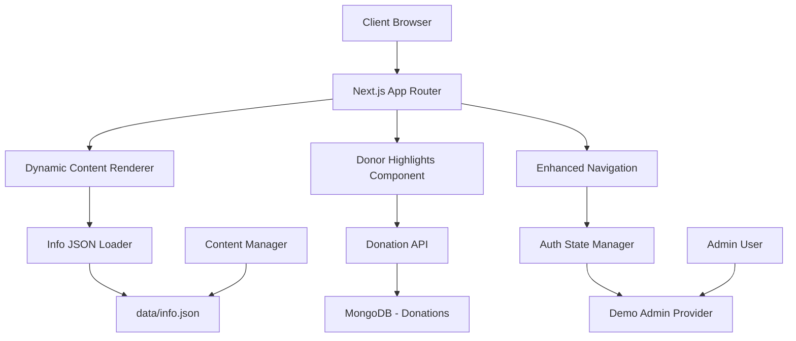

# Design Document

## Overview

The Dynamic Content Management and Donor Highlights system extends the existing NGO website with a JSON-driven content management approach and an engaging donor recognition display. The design emphasizes seamless integration with the current Next.js architecture while providing flexible content management and motivational donor recognition features.

## Architecture

### High-Level Architecture Integration



### Technology Integration

- **Content Management**: JSON-based configuration with TypeScript interfaces
- **State Management**: React Context for content and authentication state
- **Caching**: Next.js built-in caching with revalidation for JSON content
- **Animation**: Framer Motion for smooth donor highlight scrolling
- **Validation**: Zod schemas for JSON structure validation

## Components and Interfaces

### Content Management System

#### JSON Structure Interface

```typescript
interface InfoJSON {
  organization: {
    name: string;
    email: string;
    head_office_address: string;
    phone_numbers: string[];
    copyright_year: number;
    social_links?: {
      facebook?: string;
      youtube?: string;
      instagram?: string;
    };
    logo_image?: string;
  };

  navigation: NavigationItem[];

  hero_section: {
    title: string;
    subtitle: string;
    motto: Record<string, string>;
    buttons: ButtonConfig[];
    image?: string;
  };

  highlight_cards: HighlightCard[];
  mission_section: ContentSection;
  call_to_action: ContentSection;
  achievements_section: AchievementsSection;
  about_section: ContentSection;
  blog_section: BlogSection;
  team_section: TeamSection;
  footer: FooterConfig;
}

interface NavigationItem {
  id: number;
  label: string;
  link?: string;
  children?: NavigationItem[];
}

interface ContentSection {
  heading: string;
  text: string;
  button?: ButtonConfig;
  image?: string;
}

interface ButtonConfig {
  label: string;
  link?: string;
  variant?: 'primary' | 'secondary' | 'outline';
}
```

#### Dynamic Content Provider

```typescript
// lib/content-provider.tsx
interface ContentContextType {
  content: InfoJSON;
  loading: boolean;
  error: string | null;
  reloadContent: () => Promise<void>;
}

export const ContentProvider: React.FC<{ children: React.ReactNode }> = ({ children }) => {
  const [content, setContent] = useState<InfoJSON | null>(null);
  const [loading, setLoading] = useState(true);
  const [error, setError] = useState<string | null>(null);

  const loadContent = useCallback(async () => {
    try {
      setLoading(true);
      const response = await fetch('/api/content');
      const data = await response.json();

      // Validate with Zod schema
      const validatedContent = InfoJSONSchema.parse(data);
      setContent(validatedContent);
      setError(null);
    } catch (err) {
      setError('Failed to load content');
      // Load fallback content
      setContent(getFallbackContent());
    } finally {
      setLoading(false);
    }
  }, []);

  return (
    <ContentContext.Provider value={{ content, loading, error, reloadContent: loadContent }}>
      {children}
    </ContentContext.Provider>
  );
};
```

#### Content API Route

```typescript
// app/api/content/route.ts
export async function GET() {
  try {
    const filePath = path.join(process.cwd(), 'data', 'info.json');
    const fileContent = await fs.readFile(filePath, 'utf8');
    const jsonData = JSON.parse(fileContent);

    // Validate structure
    const validatedData = InfoJSONSchema.parse(jsonData);

    return NextResponse.json(validatedData, {
      headers: {
        'Cache-Control': 'public, s-maxage=60, stale-while-revalidate=300'
      }
    });
  } catch (error) {
    return NextResponse.json(
      { error: 'Failed to load content' },
      { status: 500 }
    );
  }
}
```

### Donor Highlights System

#### Donor Highlights Component

```typescript
// components/public/DonorHighlights.tsx
interface DonorHighlight {
  id: string;
  name: string;
  amount: number;
  isAnonymous: boolean;
  createdAt: Date;
}

export const DonorHighlights: React.FC = () => {
  const [donors, setDonors] = useState<DonorHighlight[]>([]);
  const [isLoading, setIsLoading] = useState(true);

  useEffect(() => {
    const fetchDonors = async () => {
      try {
        const response = await fetch('/api/donors/highlights');
        const data = await response.json();
        setDonors(data.donors);
      } catch (error) {
        console.error('Failed to fetch donor highlights:', error);
      } finally {
        setIsLoading(false);
      }
    };

    fetchDonors();

    // Set up real-time updates
    const interval = setInterval(fetchDonors, 30000); // Update every 30 seconds
    return () => clearInterval(interval);
  }, []);

  if (isLoading) {
    return <DonorHighlightsSkeleton />;
  }

  return (
    <div className="donor-highlights-container overflow-hidden bg-gradient-to-r from-blue-50 to-green-50 py-4">
      <motion.div
        className="flex space-x-8 whitespace-nowrap"
        animate={{ x: [0, -100 * donors.length] }}
        transition={{
          duration: donors.length * 3,
          repeat: Infinity,
          ease: "linear"
        }}
      >
        {donors.map((donor, index) => (
          <DonorCard key={`${donor.id}-${index}`} donor={donor} />
        ))}
      </motion.div>
    </div>
  );
};

const DonorCard: React.FC<{ donor: DonorHighlight }> = ({ donor }) => (
  <div className="flex items-center space-x-3 bg-white rounded-lg shadow-sm px-4 py-2 min-w-max">
    <div className="w-8 h-8 bg-gradient-to-r from-blue-500 to-green-500 rounded-full flex items-center justify-center text-white font-bold text-sm">
      {donor.isAnonymous ? '?' : donor.name.charAt(0).toUpperCase()}
    </div>
    <div>
      <p className="font-semibold text-gray-800">
        {donor.isAnonymous ? 'Anonymous Donor' : donor.name}
      </p>
      <p className="text-sm text-gray-600">₹{donor.amount.toLocaleString()}</p>
    </div>
  </div>
);
```

#### Donor Highlights API

```typescript
// app/api/donors/highlights/route.ts
export async function GET() {
  try {
    await connectDB();

    const donors = await Donation.aggregate([
      {
        $match: {
          paymentStatus: 'SUCCESS',
          // Only include donors who haven't opted out
          hideFromPublicDisplay: { $ne: true }
        }
      },
      {
        $group: {
          _id: '$donorEmail',
          name: { $first: '$donorName' },
          totalAmount: { $sum: '$amount' },
          isAnonymous: { $first: '$isAnonymous' },
          lastDonation: { $max: '$createdAt' }
        }
      },
      {
        $sort: { totalAmount: -1 }
      },
      {
        $limit: 50 // Limit to top 50 donors for performance
      }
    ]);

    const formattedDonors = donors.map(donor => ({
      id: donor._id,
      name: donor.name,
      amount: donor.totalAmount,
      isAnonymous: donor.isAnonymous || false,
      createdAt: donor.lastDonation
    }));

    return NextResponse.json({ donors: formattedDonors });
  } catch (error) {
    return NextResponse.json(
      { error: 'Failed to fetch donor highlights' },
      { status: 500 }
    );
  }
}
```

### Enhanced Navigation System

#### Navigation Component with Auth UI

```typescript
// components/common/Navigation.tsx
export const Navigation: React.FC = () => {
  const { data: session, status } = useSession();
  const { content } = useContent();
  const [isMobileMenuOpen, setIsMobileMenuOpen] = useState(false);

  if (!content) return <NavigationSkeleton />;

  return (
    <nav className="bg-white shadow-lg sticky top-0 z-50">
      <div className="max-w-7xl mx-auto px-4 sm:px-6 lg:px-8">
        <div className="flex justify-between items-center h-16">
          {/* Logo and Organization Name */}
          <div className="flex items-center space-x-3">
            {content.organization.logo_image && (
              <Image
                src={content.organization.logo_image}
                alt={content.organization.name}
                width={40}
                height={40}
                className="rounded-full"
              />
            )}
            <span className="font-bold text-xl text-gray-800">
              {content.organization.name}
            </span>
          </div>

          {/* Desktop Navigation */}
          <div className="hidden md:flex items-center space-x-8">
            {content.navigation.map((item) => (
              <NavigationItem key={item.id} item={item} />
            ))}

            {/* Auth Buttons */}
            <AuthButtons session={session} status={status} />
          </div>

          {/* Mobile Menu Button */}
          <div className="md:hidden">
            <button
              onClick={() => setIsMobileMenuOpen(!isMobileMenuOpen)}
              className="text-gray-600 hover:text-gray-800"
            >
              <Menu className="h-6 w-6" />
            </button>
          </div>
        </div>

        {/* Mobile Menu */}
        <MobileMenu
          isOpen={isMobileMenuOpen}
          navigation={content.navigation}
          session={session}
          onClose={() => setIsMobileMenuOpen(false)}
        />
      </div>
    </nav>
  );
};

const AuthButtons: React.FC<{ session: Session | null; status: string }> = ({ session, status }) => {
  if (status === 'loading') {
    return <div className="w-20 h-8 bg-gray-200 animate-pulse rounded" />;
  }

  if (session) {
    return (
      <div className="flex items-center space-x-4">
        <UserMenu session={session} />
      </div>
    );
  }

  return (
    <div className="flex items-center space-x-3">
      <Link
        href="/login"
        className="text-gray-600 hover:text-gray-800 font-medium"
      >
        Login
      </Link>
      <Link
        href="/register"
        className="bg-blue-600 text-white px-4 py-2 rounded-lg hover:bg-blue-700 transition-colors"
      >
        Sign Up
      </Link>
    </div>
  );
};
```

### Demo Admin System

#### Demo Admin Provider

```typescript
// lib/demo-admin.ts
interface DemoAdminConfig {
  email: string;
  password: string;
  name: string;
  role: 'ADMIN';
}

export const getDemoAdminConfig = (): DemoAdminConfig => {
  // Check for environment variables first
  if (process.env.DEMO_ADMIN_EMAIL && process.env.DEMO_ADMIN_PASSWORD) {
    return {
      email: process.env.DEMO_ADMIN_EMAIL,
      password: process.env.DEMO_ADMIN_PASSWORD,
      name: process.env.DEMO_ADMIN_NAME || 'Demo Administrator',
      role: 'ADMIN'
    };
  }

  // Fallback to hard-coded credentials
  return {
    email: 'admin@arpufrl.demo',
    password: 'DemoAdmin@2025',
    name: 'Demo Administrator',
    role: 'ADMIN'
  };
};

export const isDemoAdmin = (email: string): boolean => {
  const demoConfig = getDemoAdminConfig();
  return email === demoConfig.email;
};
```

#### Demo Admin Authentication

```typescript
// lib/auth.ts (updated)
export const authOptions: NextAuthOptions = {
  providers: [
    CredentialsProvider({
      name: 'credentials',
      credentials: {
        email: { label: 'Email', type: 'email' },
        password: { label: 'Password', type: 'password' }
      },
      async authorize(credentials) {
        if (!credentials?.email || !credentials?.password) {
          return null;
        }

        // Check for demo admin first
        const demoConfig = getDemoAdminConfig();
        if (credentials.email === demoConfig.email &&
            credentials.password === demoConfig.password) {
          return {
            id: 'demo-admin',
            email: demoConfig.email,
            name: demoConfig.name,
            role: demoConfig.role,
            isDemoAccount: true
          };
        }

        // Regular user authentication
        await connectDB();
        const user = await User.findOne({ email: credentials.email });

        if (!user || !await bcrypt.compare(credentials.password, user.hashedPassword)) {
          return null;
        }

        return {
          id: user._id.toString(),
          email: user.email,
          name: user.name,
          role: user.role,
          isDemoAccount: false
        };
      }
    })
  ],
  callbacks: {
    async jwt({ token, user }) {
      if (user) {
        token.role = user.role;
        token.isDemoAccount = user.isDemoAccount;
      }
      return token;
    },
    async session({ session, token }) {
      session.user.role = token.role;
      session.user.isDemoAccount = token.isDemoAccount;
      return session;
    }
  }
};
```

## Data Models

### Extended Donation Model

```typescript
// Add to existing Donation schema
interface DonationExtended extends Donation {
  // Privacy settings
  isAnonymous: boolean;
  hideFromPublicDisplay: boolean;
  displayName?: string; // Custom name for public display

  // Highlight tracking
  highlightedAt?: Date;
  highlightPriority: number; // For sorting in highlights
}
```

### Content Configuration Model

```typescript
interface ContentConfig {
  _id: ObjectId;
  version: string;
  content: InfoJSON;
  isActive: boolean;
  createdAt: Date;
  updatedAt: Date;
  createdBy: ObjectId; // Admin who updated content
}
```

## Error Handling

### Content Loading Fallbacks

- **JSON Parse Errors**: Graceful fallback to default content structure
- **Missing Fields**: Individual field fallbacks with logging
- **Network Errors**: Cached content with offline indicators
- **Validation Errors**: Partial content loading with error boundaries

### Donor Highlights Error Handling

- **API Failures**: Show cached donor list or hide component gracefully
- **Animation Errors**: Fallback to static display
- **Privacy Violations**: Automatic filtering and audit logging
- **Performance Issues**: Pagination and lazy loading implementation

## Testing Strategy

### Content Management Testing

- **JSON Validation**: Test schema validation with various invalid inputs
- **Fallback Content**: Verify fallback mechanisms work correctly
- **Performance**: Test content loading speed and caching effectiveness
- **Integration**: Test content updates reflect across all components

### Donor Highlights Testing

- **Real-time Updates**: Test automatic refresh and data synchronization
- **Privacy Controls**: Verify anonymity settings are respected
- **Performance**: Test smooth scrolling with large donor lists
- **Responsive Design**: Test display across different screen sizes

### Authentication Testing

- **Demo Admin Access**: Test hard-coded and environment-based credentials
- **Role-based Navigation**: Verify correct UI elements show for each role
- **Session Management**: Test authentication state persistence
- **Security**: Test demo admin isolation and audit logging

## Security Considerations

### Content Security

- **JSON Validation**: Strict schema validation to prevent injection
- **File Access**: Secure file reading with path validation
- **Content Sanitization**: HTML sanitization for user-generated content
- **Version Control**: Track content changes with audit trails

### Demo Admin Security

- **Credential Management**: Secure storage of demo credentials
- **Access Logging**: Comprehensive audit trail for demo admin actions
- **Isolation**: Prevent demo admin from affecting production data
- **Environment Separation**: Different credentials for different environments

### Privacy Protection

- **Donor Anonymity**: Strict enforcement of privacy preferences
- **Data Minimization**: Only collect necessary donor information
- **Consent Management**: Clear opt-in/opt-out mechanisms
- **GDPR Compliance**: Right to be forgotten implementation

This design provides a robust foundation for dynamic content management and donor recognition while maintaining security, performance, and user experience standards.