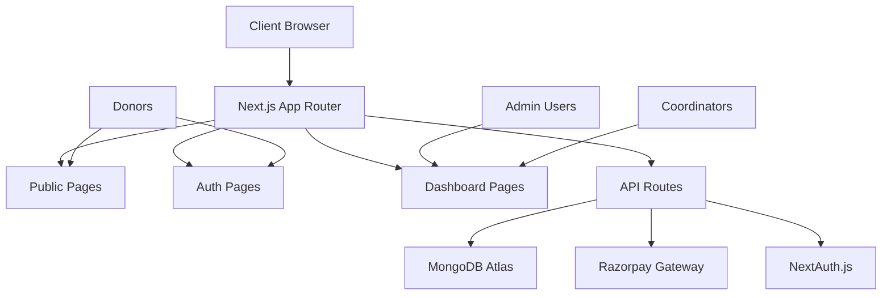

# Design Document

## Overview

The ARPU Future Rise Life Foundation website will be built as a modern, scalable web application using Next.js 15 with the App Router architecture. The system follows a microservices-inspired approach with clear separation between public-facing pages, authenticated user areas, and administrative functions. The design emphasizes performance, security, and user experience while maintaining the professional standards expected of an NGO platform.

## Architecture

### High-Level Architecture



### Technology Stack

- **Frontend**: Next.js 15 (App Router), TypeScript, Tailwind CSS, Shadcn UI
- **Backend**: Next.js API Routes, Mongoose ODM
- **Database**: MongoDB Atlas with connection pooling
- **Authentication**: NextAuth.js with JWT tokens
- **Payments**: Razorpay integration with webhook verification
- **Validation**: Zod schemas for type-safe validation
- **Forms**: React Hook Form with Zod resolvers

### Deployment Architecture

- **Hosting**: Vercel (recommended) or similar platform
- **Database**: MongoDB Atlas (cloud-hosted)
- **CDN**: Vercel Edge Network for static assets
- **Environment**: Separate staging and production environments

## Components and Interfaces

### Directory Structure

```
app/
├── (public)/                 # Public-facing pages
│   ├── page.tsx              # Homepage
│   ├── about/
│   ├── programs/
│   ├── donate/
│   ├── stories/
│   └── contact/
├── (auth)/                   # Authentication pages
│   ├── login/
│   └── register/
├── dashboard/                # Protected dashboard area
│   ├── admin/
│   └── coordinator/
├── api/                      # API routes
│   ├── auth/
│   ├── donations/
│   ├── users/
│   ├── programs/
│   └── webhooks/
└── globals.css

components/
├── ui/                       # Shadcn UI components
├── common/                   # Shared components
│   ├── Header.tsx
│   ├── Footer.tsx
│   ├── Navigation.tsx
│   └── LoadingSpinner.tsx
├── forms/                    # Form components
│   ├── DonationForm.tsx
│   ├── LoginForm.tsx
│   └── ContactForm.tsx
└── dashboard/                # Dashboard-specific components
    ├── DonationTable.tsx
    ├── StatsCard.tsx
    └── ReferralTree.tsx

lib/
├── db.ts                     # MongoDB connection
├── auth.ts                   # NextAuth configuration
├── validations.ts            # Zod schemas
├── razorpay.ts              # Payment utilities
└── utils.ts                  # Helper functions

models/                       # Mongoose schemas
├── User.ts
├── Donation.ts
├── Program.ts
└── ReferralCode.ts
```

### Core Components

#### 1. Public Interface Components

**Header Component**
- Responsive navigation with mobile hamburger menu
- Logo and organization branding
- Call-to-action donate button
- Language selector (if multilingual support needed)

**Hero Section**
- Compelling mission statement
- Key impact statistics
- Primary donation call-to-action
- Background image or video

**Program Cards**
- Grid layout with responsive design
- Program images, descriptions, and funding progress
- Individual donation buttons
- Progress bars for funding goals

#### 2. Donation System Components

**Multi-Step Donation Form**
- Amount selection with preset options
- Program selection dropdown
- Donor information collection
- Referral code input field
- Payment method selection
- Terms and conditions acceptance

**Payment Integration**
- Razorpay checkout modal
- Payment status indicators
- Success/failure handling
- Receipt generation and email

#### 3. Dashboard Components

**Admin Dashboard**
- Real-time statistics cards
- Donation table with filtering and sorting
- User management interface
- Program management tools
- Referral system overview

**Coordinator Portal**
- Personal referral code display
- Attribution metrics and charts
- Sub-coordinator management
- Performance tracking

## Data Models

### User Schema

```typescript
interface User {
  _id: ObjectId;
  name: string;
  email: string;
  phone?: string;
  role: 'ADMIN' | 'COORDINATOR' | 'SUB_COORDINATOR' | 'DONOR';
  status: 'ACTIVE' | 'INACTIVE' | 'PENDING';
  hashedPassword?: string;
  emailVerified?: Date;
  image?: string;
  createdAt: Date;
  updatedAt: Date;

  // Coordinator-specific fields
  region?: string;
  parentCoordinatorId?: ObjectId;
}
```

### Donation Schema

```typescript
interface Donation {
  _id: ObjectId;
  donorName: string;
  donorEmail?: string;
  donorPhone?: string;
  amount: number;
  currency: string;
  programId?: ObjectId;

  // Payment tracking
  paymentStatus: 'PENDING' | 'SUCCESS' | 'FAILED' | 'REFUNDED';
  razorpayOrderId: string;
  razorpayPaymentId?: string;
  razorpaySignature?: string;

  // Referral tracking
  referralCodeId?: ObjectId;
  attributedToUserId?: ObjectId;

  // Metadata
  ipAddress?: string;
  userAgent?: string;
  createdAt: Date;
  updatedAt: Date;
}
```

### Program Schema

```typescript
interface Program {
  _id: ObjectId;
  name: string;
  slug: string;
  description: string;
  longDescription?: string;
  image?: string;
  gallery?: string[];

  // Funding details
  targetAmount?: number;
  raisedAmount: number;
  donationCount: number;

  // Status and visibility
  active: boolean;
  featured: boolean;
  priority: number;

  // SEO
  metaTitle?: string;
  metaDescription?: string;

  createdAt: Date;
  updatedAt: Date;
}
```

### ReferralCode Schema

```typescript
interface ReferralCode {
  _id: ObjectId;
  code: string; // Unique referral code
  ownerUserId: ObjectId;
  parentCodeId?: ObjectId; // For hierarchy

  type: 'COORDINATOR' | 'SUB_COORDINATOR';
  region?: string;
  active: boolean;

  // Performance tracking
  totalDonations: number;
  totalAmount: number;
  lastUsed?: Date;

  createdAt: Date;
  updatedAt: Date;
}
```

## Error Handling

### Client-Side Error Handling

- **Form Validation**: Real-time validation using Zod schemas
- **Network Errors**: Retry mechanisms with exponential backoff
- **Payment Failures**: Clear error messages and retry options
- **Loading States**: Skeleton loaders and progress indicators

### Server-Side Error Handling

- **API Error Responses**: Standardized error format with status codes
- **Database Errors**: Connection retry logic and graceful degradation
- **Payment Webhook Errors**: Idempotent processing and retry queues
- **Authentication Errors**: Secure error messages without information leakage

### Error Logging and Monitoring

- **Error Tracking**: Integration with services like Sentry or LogRocket
- **Performance Monitoring**: Core Web Vitals tracking
- **Database Monitoring**: Query performance and connection health
- **Payment Monitoring**: Transaction success rates and failure analysis

## Testing Strategy

### Unit Testing

- **Utility Functions**: Test helper functions and validation schemas
- **API Routes**: Test individual endpoints with mocked dependencies
- **Components**: Test React components with React Testing Library
- **Database Models**: Test Mongoose schema validation and methods

### Integration Testing

- **Payment Flow**: End-to-end donation process testing
- **Authentication**: Login/logout and session management
- **Referral Attribution**: Test referral code resolution and attribution
- **Email Notifications**: Test email sending and template rendering

### Performance Testing

- **Load Testing**: Simulate high traffic scenarios
- **Database Performance**: Test query optimization and indexing
- **Payment Gateway**: Test Razorpay integration under load
- **Mobile Performance**: Test on various devices and network conditions

### Security Testing

- **Input Validation**: Test for SQL injection and XSS vulnerabilities
- **Authentication**: Test session management and authorization
- **Payment Security**: Verify PCI compliance and secure data handling
- **API Security**: Test rate limiting and CORS configuration

## Security Considerations

### Data Protection

- **Encryption**: AES-256 encryption for sensitive data at rest
- **HTTPS**: SSL/TLS encryption for all data in transit
- **PII Handling**: Minimal collection and secure storage of personal data
- **Payment Data**: PCI DSS compliance with tokenization

### Authentication and Authorization

- **Password Security**: Bcrypt hashing with salt rounds
- **Session Management**: Secure JWT tokens with appropriate expiration
- **Role-Based Access**: Granular permissions for different user types
- **Multi-Factor Authentication**: Optional 2FA for admin accounts

### API Security

- **Rate Limiting**: Prevent abuse with request throttling
- **CORS Configuration**: Restrict cross-origin requests appropriately
- **Input Sanitization**: Validate and sanitize all user inputs
- **SQL Injection Prevention**: Use parameterized queries and ORM

### Infrastructure Security

- **Environment Variables**: Secure storage of sensitive configuration
- **Database Security**: Network isolation and access controls
- **Webhook Security**: Signature verification for payment webhooks
- **Regular Updates**: Keep dependencies and frameworks updated

## Performance Optimization

### Frontend Optimization

- **Code Splitting**: Lazy loading of non-critical components
- **Image Optimization**: Next.js Image component with WebP format
- **Caching Strategy**: Browser caching and CDN utilization
- **Bundle Optimization**: Tree shaking and minification

### Backend Optimization

- **Database Indexing**: Optimize queries with appropriate indexes
- **Connection Pooling**: Efficient database connection management
- **Caching**: Redis or in-memory caching for frequently accessed data
- **API Response Optimization**: Pagination and field selection

### SEO and Accessibility

- **Server-Side Rendering**: SEO-friendly content rendering
- **Structured Data**: Schema.org markup for rich snippets
- **Accessibility**: WCAG 2.1 AA compliance
- **Core Web Vitals**: Optimize for Google's performance metrics

This design provides a solid foundation for building a modern, scalable NGO website that meets all the specified requirements while maintaining high standards for security, performance, and user experience.